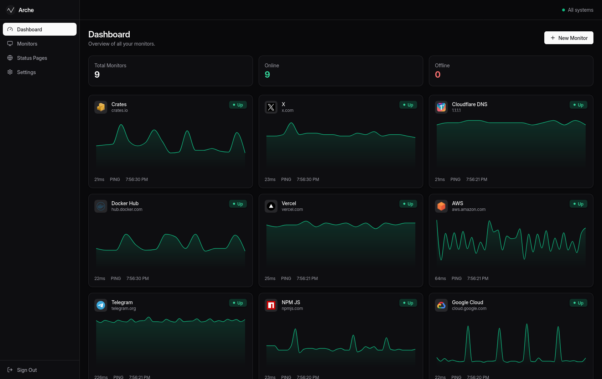

<h1 align="center">Arche</h1>

<p align="center">

</p>

<p align="center">
  <a href="https://github.com/arche-monitoring/arche">
    
  </a>


<a href="https://deps.rs/repo/github/arche-monitoring/arche">
    
  </a>


</p>

## What is Arche?

Arche is a modern, beautiful and lightweight self-hosted monitoring tool. Runs seamlessly under 100MB of RAM on Linux (x64 & arm64) and macOS (x64 & Apple Silicon).

## Features

- **🛡️ Multiple Check Types** — HTTP(S), Ping, TCP, Port scan, DNS resolution, IMAP login, and SMTP handshake.
- **⏱️ Configurable Intervals** — Fine-grained control with per-monitor check intervals and custom timeouts.
- **🌐 Status Pages** — Create beautiful, public-facing status pages with custom slugs.
- **🔔 Instant Alerts** — Get notified immediately via Telegram bots or Discord webhooks on status changes.
- **📊 Uptime Stats** — Monitor reliability at a glance with 24h, 7d, and 30d uptime percentages.

## Install

Get started using Docker:

```bash
docker pull ghcr.io/arche-monitoring/arche
docker run -p 3000:3000 -v arche_data:/app/data --name arche --restart=always ghcr.io/arche-monitoring/arche
```

Ready to go! Open http://localhost:3000 in your browser to get started.

## Sponsor

If you find Arche useful, please consider becoming a sponsor: as an independent open-source project, we rely on community backing to keep Arche beautiful, lightweight and actively maintained. Take a look at our [GitHub Sponsors](https://github.com/sponsors/andresribeiro) page to see how you can help.

If you have a few seconds, a star on GitHub helps us a lot!

## License

MIT
